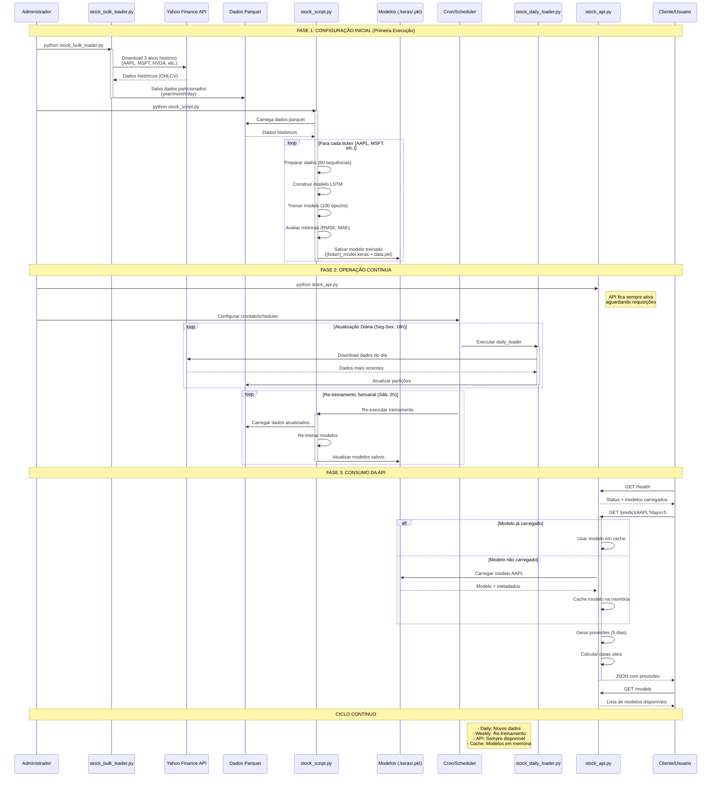

# Sistema de Previsão de Ações com LSTM

Um sistema completo para coletar dados de ações, treinar modelos de previsão usando LSTM (Long Short-Term Memory) e servir previsões através de uma API REST.

## 📋 Funcionalidades

- **Coleta de Dados**: Download automático de dados históricos de ações usando Yahoo Finance
- **Treinamento de Modelos**: Modelos LSTM personalizados para cada ticker
- **API REST**: Endpoints para obter previsões e gerenciar modelos

## 📈 Como rodar localmente

```bash
# 1. Instalar as dependencias
pip install -r requirements.txt

# 2. Coletar dados históricos
python stock_bulk_loader.py

# 3. Treinar modelos
python stock_script.py

# 4. Iniciar API
flask --app stock_api.py run --host=0.0.0.0 --port=5000

# 5. Fazer previsões
curl http://localhost:5000/predict/AAPL?days=5

# 6. Atualização diária (crontab)
python stock_daily_loader.py
```

## 🏗️ Arquitetura



## 🚀 Instalação

### Dependências

```bash
pip install -r requirements.txt
```

### Tickers Suportados (Padrão)

- AAPL (Apple)
- MSFT (Microsoft) 
- NVDA (NVIDIA)
- AMZN (Amazon)
- META (Meta/Facebook)
- BRK-B (Berkshire Hathaway)
- GOOGL/GOOG (Google/Alphabet)
- AVGO (Broadcom)
- TSLA (Tesla)

## 📊 Coleta de Dados

### Carregamento Inicial (3 anos de histórico)

```bash
python stock_bulk_loader.py
```

### Atualização Diária

```bash
python stock_daily_loader.py
```

Os dados são salvos em formato Parquet com particionamento por ano/mês/dia para otimizar consultas.

## 🤖 Treinamento de Modelos

### Treinamento Interativo

```bash
python stock_script.py
```

O script oferece opções interativas para:
- Selecionar tickers específicos ou treinar todos
- Configurar número de epochs
- Visualizar métricas de performance

### Parâmetros do Modelo

- **Arquitetura**: 3 camadas LSTM (50 neurônios cada) + Dropout (0.2)
- **Sequência**: 60 dias de histórico para previsão
- **Otimizador**: Adam (learning_rate=0.001)
- **Função de Perda**: Mean Squared Error

### Métricas de Avaliação

- **MSE** (Mean Squared Error)
- **MAE** (Mean Absolute Error) 
- **RMSE** (Root Mean Squared Error)

## 🌐 API REST

### Iniciar o Servidor

```bash
flask --app stock_api.py run --host=0.0.0.0 --port=5000
```

### Endpoints Disponíveis

#### 1. Health Check
```
GET /health
```
**Resposta:**
```json
{
  "status": "healthy",
  "timestamp": "2025-05-27 10:30:00",
  "loaded_models": ["AAPL", "MSFT"]
}
```

#### 2. Previsão de Ações
```
GET /predict/<ticker>?days=5
```

**Parâmetros:**
- `ticker`: Símbolo da ação (ex: AAPL)
- `days`: Número de dias para prever (1-30, padrão: 5)

**Exemplo:**
```bash
curl http://localhost:5000/predict/AAPL?days=7
```

**Resposta:**
```json
{
  "ticker": "AAPL",
  "predictions": [
    {
      "date": "2025-05-28",
      "predicted_close": 182.45
    },
    {
      "date": "2025-05-29", 
      "predicted_close": 184.20
    }
  ],
  "prediction_date": "2025-05-27 10:30:00",
  "model_info": {
    "sequence_length": 60,
    "trained_ticker": "AAPL"
  }
}
```

#### 3. Listar Modelos
```
GET /models
```

**Resposta:**
```json
{
  "available_models": [
    {
      "ticker": "AAPL",
      "model_file": "aapl_model.keras", 
      "loaded": true
    }
  ],
  "total_models": 1
}
```

## 📁 Estrutura de Arquivos

### Modelos Salvos
Cada modelo gera dois arquivos:
- `{ticker}_model.keras`: Modelo neural Keras
- `{ticker}_data.pkl`: Scaler e metadados (joblib)

### Dados Particionados
```
dados/
├── year=2022/
│   ├── month=1/
│   │   ├── day=1/
│   │   └── day=2/
│   └── month=2/
├── year=2023/
└── year=2024/
```

## 🔧 Configuração Avançada

### Personalizar Tickers

Edite as listas nos arquivos `stock_bulk_loader.py` e `stock_daily_loader.py`:

```python
tickers = 'AAPL MSFT NVDA AMZN META GOOG TSLA'  # Seus tickers
```

### Ajustar Parâmetros do Modelo

No arquivo `stock_predictor.py`, classe `StockPredictor`:

```python
def __init__(self, sequence_length=60):  # Janela de histórico
    
def build_model(self):
    # Ajustar camadas LSTM, dropout, etc.
```

### Configurar Diretórios

No arquivo `stock_api.py`:

```python
prediction_api = StockPredictionAPI(models_dir="meus_modelos")
```

## ⚠️ Tratamento de Erros

### Erros Comuns

1. **Modelo não encontrado (404)**
   ```json
   {
     "error": "Modelo não encontrado para o ticker XYZ",
     "message": "Você precisa treinar um modelo para este ticker primeiro"
   }
   ```

2. **Dias inválidos (400)**
   ```json
   {
     "error": "Número de dias deve estar entre 1 e 30"
   }
   ```

3. **Dados insuficientes**
   - Mínimo necessário: 65+ registros por ticker (sequence_length + 5)

## 🔄 Automação e Monitoramento

### Crontab para Atualizações

```bash
# Atualização diária às 18h (após fechamento do mercado)
0 18 * * 1-5 cd /path/to/project && python stock_daily_loader.py

# Re-treinamento semanal
0 2 * * 6 cd /path/to/project && python stock_script.py
```

### Logs e Monitoramento

A API utiliza logging Python padrão. Para logs estruturados:

```python
import logging
logging.basicConfig(
    level=logging.INFO,
    format='%(asctime)s - %(name)s - %(levelname)s - %(message)s'
)
```