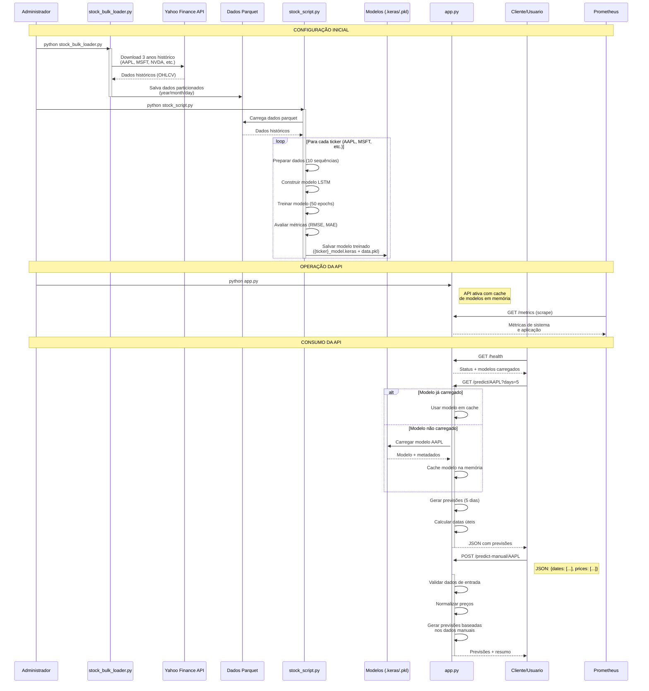

# Sistema de Previsão de Ações com LSTM

Um sistema completo para coletar dados de ações, treinar modelos de previsão usando LSTM (Long Short-Term Memory) e servir previsões através de uma API REST com monitoramento Prometheus.

## 📋 Funcionalidades

- **Coleta de Dados**: Download automático de dados históricos de ações usando Yahoo Finance
- **Treinamento de Modelos**: Modelos LSTM personalizados para cada ticker
- **API REST**: Endpoints para obter previsões e gerenciar modelos
- **Predição Manual**: Inserir dados manualmente e obter previsões
- **Monitoramento**: Métricas Prometheus para tráfego, disponibilidade e saturação

## 📈 Como rodar localmente

```bash
# 1. Instalar as dependências
pip install -r requirements.txt

# 2. Coletar dados históricos
python stock_bulk_loader.py

# 3. Treinar modelos
python stock_script.py

# opção - Rodar via Docker
docker-compose up -d

# 4. Subir a API
gunicorn --config gunicorn.conf.py app:app
```

## Arquitetura



### Tickers Suportados (Padrão)

- AAPL (Apple)
- MSFT (Microsoft) 
- NVDA (NVIDIA)
- AMZN (Amazon)
- META (Meta/Facebook)
- BRK-B (Berkshire Hathaway)
- GOOGL/GOOG (Google/Alphabet)
- AVGO (Broadcom)
- TSLA (Tesla)

## Coleta de Dados

### Carregamento em Lote (3 anos de histórico)

```bash
python stock_bulk_loader.py
```

Os dados são salvos em formato Parquet com particionamento por ano/mês/dia para otimizar consultas e análises.

## Treinamento de Modelos

### Treinamento Interativo

```bash
python stock_script.py
```

O script oferece opções interativas para:
- Selecionar tickers específicos ou treinar todos
- Configurar número de epochs
- Visualizar métricas de performance

### Parâmetros do Modelo

- **Arquitetura**: 3 camadas LSTM (50 neurônios cada) + Dropout (0.2)
- **Sequência**: 10 dias de histórico para previsão (configurável)
- **Otimizador**: Adam (learning_rate=0.001)
- **Função de Perda**: Mean Squared Error

### Métricas de Avaliação

- **MSE** (Mean Squared Error)
- **MAE** (Mean Absolute Error) 
- **MAPE** (Mean Absolute Percentage Error)
- **RMSE** (Root Mean Squared Error)

## API REST

### Iniciar o Servidor

```bash
gunicorn --config gunicorn.conf.py app:app
```

### Endpoints Disponíveis

#### 1. Health Check
```
GET /health
```
**Resposta:**
```json
{
  "status": "healthy",
  "timestamp": "2025-07-28 15:30:45",
  "loaded_models": ["AAPL", "MSFT"]
}
```

#### 2. Previsão Automática
```
GET /predict/<ticker>?days=5
```

**Parâmetros:**
- `ticker`: Símbolo da ação (ex: AAPL)
- `days`: Número de dias para prever (1-30, padrão: 5)

**Exemplo:**
```bash
curl http://localhost:5000/predict/AAPL?days=7
```

**Resposta:**
```json
{
  "ticker": "AAPL",
  "predictions": [
    {
      "date": "2025-07-29",
      "predicted_close": 182.45
    },
    {
      "date": "2025-07-30", 
      "predicted_close": 184.20
    }
  ],
  "prediction_date": "2025-07-28 15:30:45",
  "model_info": {
    "sequence_length": 10,
    "trained_ticker": "AAPL"
  }
}
```

#### 3. Previsão Manual
```
POST /predict-manual/<ticker>
Content-Type: application/json
```

**Body:**
```json
{
  "dates": ["2024-01-15", "2024-01-16", "2024-01-17", "2024-01-18", "2024-01-19", "2024-01-22", "2024-01-23", "2024-01-24", "2024-01-25", "2024-01-26"],
  "prices": [185.50, 187.20, 189.10, 186.75, 188.90, 190.25, 192.15, 191.80, 193.45, 195.20],
  "predict_days": 5
}
```

**Exemplo:**
```bash
curl -X POST http://localhost:5000/predict-manual/AAPL \
  -H "Content-Type: application/json" \
  -d '{
    "dates": ["2024-01-15", "2024-01-16", "2024-01-17", "2024-01-18", "2024-01-19", "2024-01-22", "2024-01-23", "2024-01-24", "2024-01-25", "2024-01-26"],
    "prices": [185.50, 187.20, 189.10, 186.75, 188.90, 190.25, 192.15, 191.80, 193.45, 195.20],
    "predict_days": 5
  }'
```

**Resposta:**
```json
{
  "ticker": "AAPL",
  "input_data": [
    {"date": "2024-01-15", "price": 185.50},
    {"date": "2024-01-16", "price": 187.20}
  ],
  "predictions": [
    {"date": "2024-01-31", "predicted_close": 198.45},
    {"date": "2024-02-01", "predicted_close": 199.20}
  ],
  "summary": {
    "last_real_price": 195.20,
    "first_predicted_price": 198.45,
    "last_predicted_price": 201.80,
    "predicted_change": 6.60,
    "predicted_change_percent": 3.38
  }
}
```

#### 4. Listar Modelos
```
GET /models
```

**Resposta:**
```json
{
  "available_models": [
    {
      "ticker": "AAPL",
      "model_file": "aapl_model.keras", 
      "loaded": true
    }
  ],
  "total_models": 1
}
```

#### 5. Métricas Prometheus
```
GET /metrics
```
Retorna métricas no formato Prometheus para monitoramento.

## Monitoramento com Prometheus

### Métricas Disponíveis

| Métrica | Tipo | Descrição |
|---------|------|-----------|
| `flask_requests_total` | Counter | Total de requisições por endpoint/status |
| `flask_request_duration_seconds` | Histogram | Duração das requisições |
| `flask_active_requests` | Gauge | Número de requisições ativas |
| `flask_memory_usage_bytes` | Gauge | Uso de memória em bytes |
| `flask_cpu_usage_percent` | Gauge | Uso de CPU em percentual |
| `flask_loaded_models_total` | Gauge | Número de modelos carregados |
| `flask_prediction_errors_total` | Counter | Erros de predição por ticker/tipo |

### Consultas PromQL Essenciais

```promql
# Taxa de requisições por segundo
rate(flask_http_requests_total[5m])

# Latência P95
histogram_quantile(0.95, rate(flask_http_request_duration_seconds_bucket[5m]))

# Taxa de erro
sum(rate(flask_http_requests_total{status=~"5.."}[5m])) / sum(rate(flask_http_requests_total[5m]))
```

### Configuração Prometheus

```yaml
# prometheus.yml
scrape_configs:
  - job_name: 'stock-prediction-api'
    static_configs:
      - targets: ['localhost:5000']
    metrics_path: '/metrics'
    scrape_interval: 5s
```

## Estrutura de Arquivos

### Dados Particionados
```
dados/
├── year=2022/
│   ├── month=1/
│   │   ├── day=1/
│   │   └── day=2/
│   └── month=2/
├── year=2023/
└── year=2024/
```